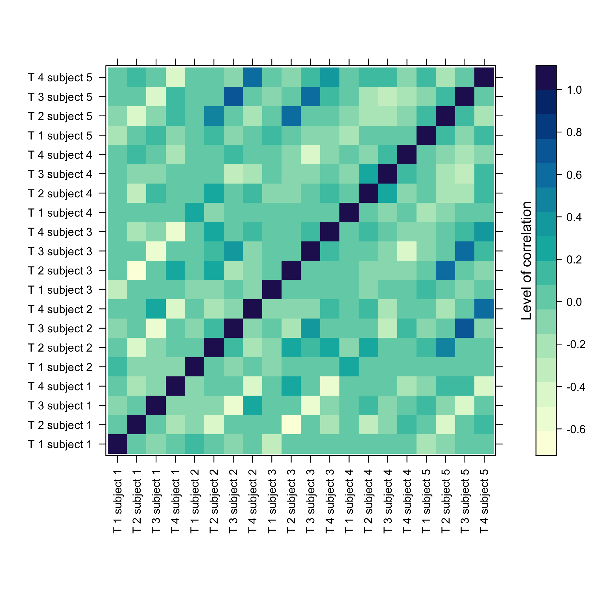
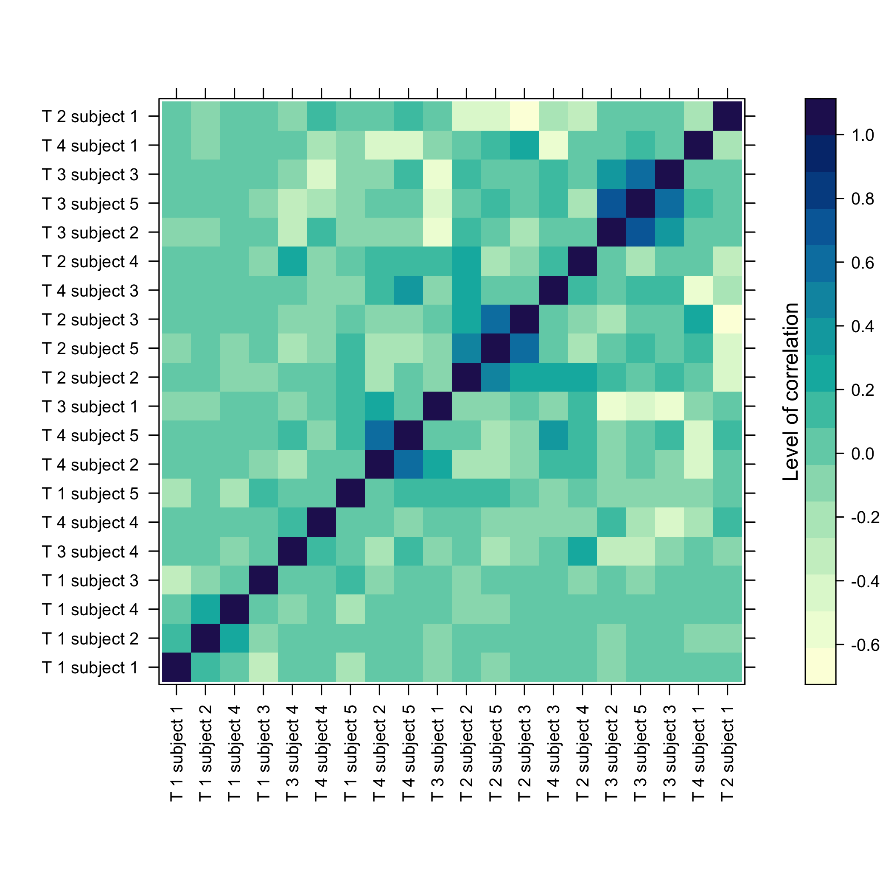
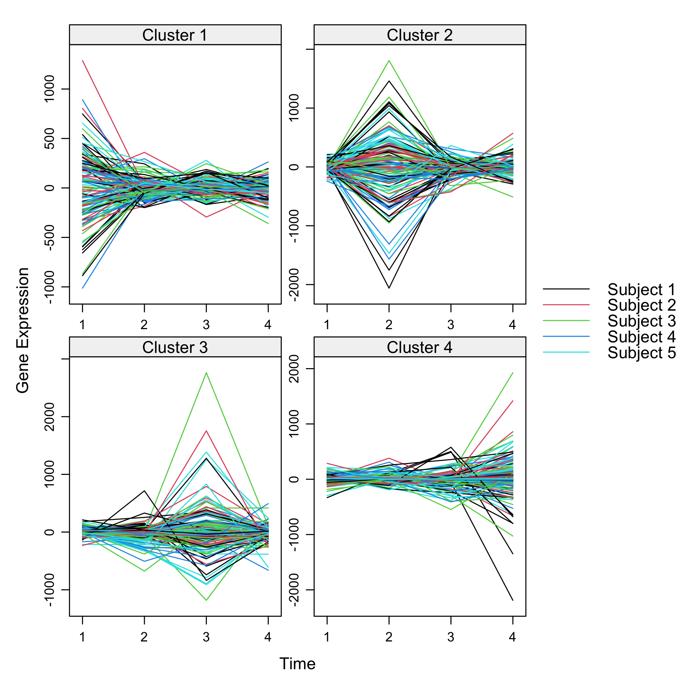
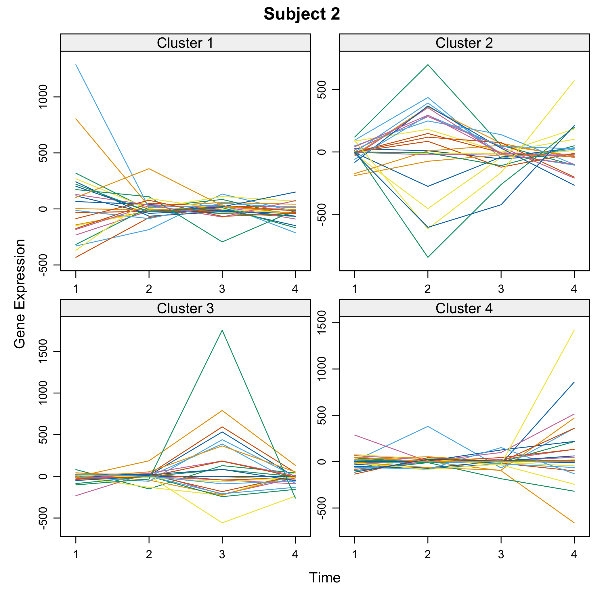
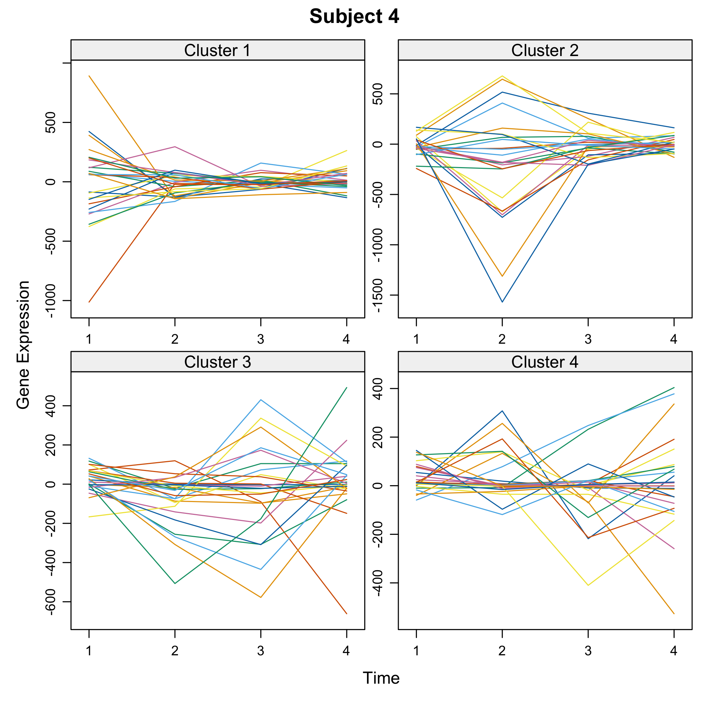
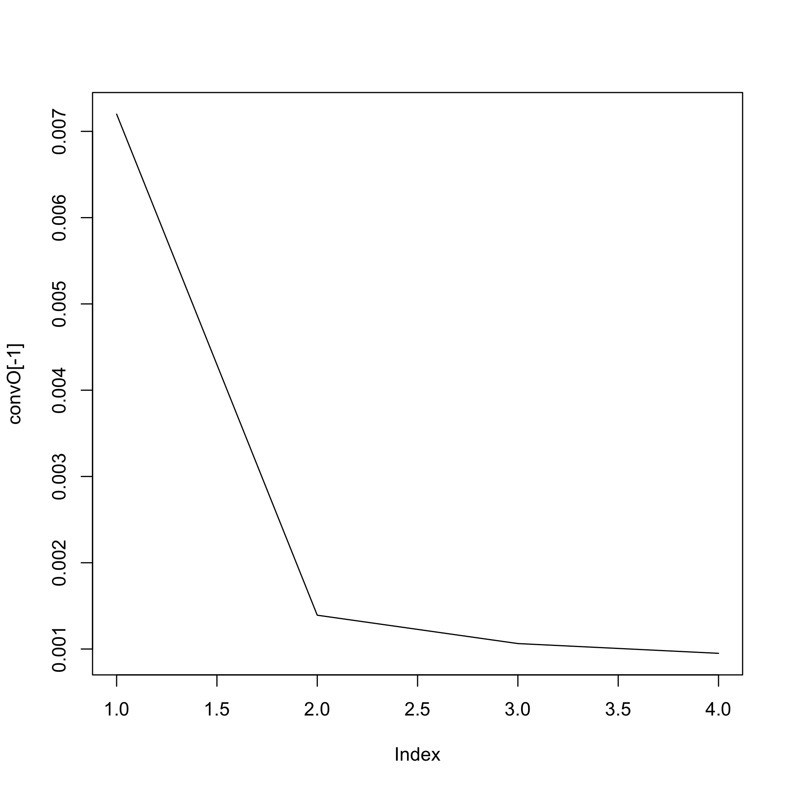
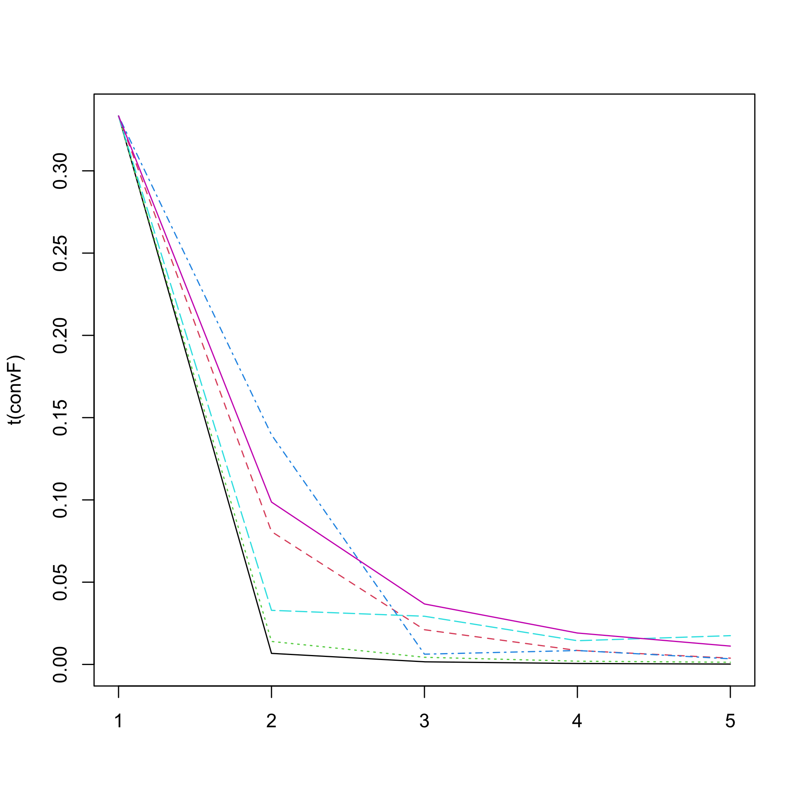
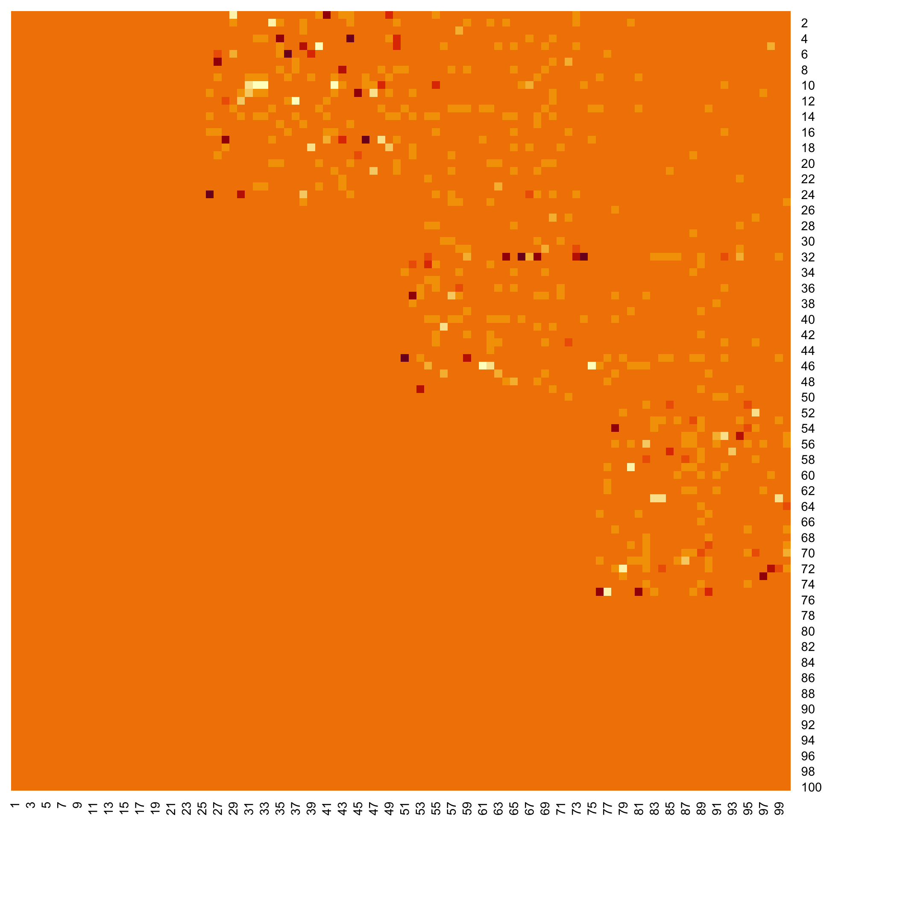

[](https://cran.r-project.org/package=Cascade)

<!-- README.md is generated from README.Rmd. Please edit that file -->


# Cascade

Cascade is a modeling tool allowing gene selection, reverse engineering, and prediction in cascade networks. Jung, N., Bertrand, F., Bahram, S., Vallat, L., and Maumy-Bertrand, M. (2014) <https://doi.org/10.1093/bioinformatics/btt705>.


The package was presented at the [User2014!](http://user2014.r-project.org/) conference. Jung, N., Bertrand, F., Bahram, S., Vallat, L., and Maumy-Bertrand, M. (2014). Cascade: a R-package to study, predict and simulate the diffusion of a signal through a temporal genenetwork, book of abstracts, User2014!, Los Angeles, page 150, <http://user2014.r-project.org/abstracts/posters/181_Jung.pdf>.

## Installation

You can install the released version of Cascade from [CRAN](https://CRAN.R-project.org) with:


```r
install.packages("Cascade")
```

You can install the development version of Cascade from [github](https://github.com) with:


```r
devtools::install_github("fbertran/Cascade")
```

## Examples

### Data management
Import Cascade Data (repeated measurements on several subjects) and turn them into a micro array object:

```r
library(Cascade)
require(CascadeData)
data(micro_US)
micro_US<-as.micro_array(micro_US,time=c(60,90,210,390),subject=6)
```

Get a summay and plots of the data:

```r
summary(micro_US)
#>    N1_US_T60        N1_US_T90        N1_US_T210       N1_US_T390    
#>  Min.   :   1.0   Min.   :   1.0   Min.   :   1.0   Min.   :   1.0  
#>  1st Qu.:  19.7   1st Qu.:  18.8   1st Qu.:  15.2   1st Qu.:  20.9  
#>  Median :  38.0   Median :  37.2   Median :  34.9   Median :  40.2  
#>  Mean   : 107.5   Mean   : 106.9   Mean   : 109.6   Mean   : 105.7  
#>  3rd Qu.:  80.6   3rd Qu.:  82.1   3rd Qu.:  82.8   3rd Qu.:  84.8  
#>  Max.   :8587.9   Max.   :8311.7   Max.   :7930.3   Max.   :7841.8  
#>    N2_US_T60        N2_US_T90        N2_US_T210       N2_US_T390    
#>  Min.   :   1.0   Min.   :   1.0   Min.   :   1.0   Min.   :   1.0  
#>  1st Qu.:  18.5   1st Qu.:  17.1   1st Qu.:  15.8   1st Qu.:  17.7  
#>  Median :  36.9   Median :  36.7   Median :  36.0   Median :  37.4  
#>  Mean   : 110.6   Mean   : 102.1   Mean   : 106.8   Mean   : 111.3  
#>  3rd Qu.:  85.3   3rd Qu.:  78.2   3rd Qu.:  83.5   3rd Qu.:  86.4  
#>  Max.   :7750.3   Max.   :8014.3   Max.   :8028.6   Max.   :7498.4  
#>    N3_US_T60        N3_US_T90        N3_US_T210       N3_US_T390    
#>  Min.   :   1.0   Min.   :   1.0   Min.   :   1.0   Min.   :   1.0  
#>  1st Qu.:  17.3   1st Qu.:  19.5   1st Qu.:  16.4   1st Qu.:  20.9  
#>  Median :  34.4   Median :  38.2   Median :  34.7   Median :  41.0  
#>  Mean   : 101.6   Mean   : 107.1   Mean   : 100.3   Mean   : 113.9  
#>  3rd Qu.:  75.4   3rd Qu.:  82.3   3rd Qu.:  76.3   3rd Qu.:  89.2  
#>  Max.   :8072.2   Max.   :7889.2   Max.   :8278.2   Max.   :6856.2  
#>    N4_US_T60        N4_US_T90        N4_US_T210       N4_US_T390    
#>  Min.   :   1.0   Min.   :   1.0   Min.   :   1.0   Min.   :   1.0  
#>  1st Qu.:  20.4   1st Qu.:  19.5   1st Qu.:  20.5   1st Qu.:  19.9  
#>  Median :  38.9   Median :  38.5   Median :  39.9   Median :  38.8  
#>  Mean   : 113.6   Mean   : 114.8   Mean   : 110.1   Mean   : 111.7  
#>  3rd Qu.:  84.6   3rd Qu.:  86.1   3rd Qu.:  86.8   3rd Qu.:  85.4  
#>  Max.   :9502.3   Max.   :9193.4   Max.   :9436.0   Max.   :8771.0  
#>    N5_US_T60        N5_US_T90        N5_US_T210       N5_US_T390    
#>  Min.   :   1.0   Min.   :   1.0   Min.   :   1.0   Min.   :   1.0  
#>  1st Qu.:  16.8   1st Qu.:  18.8   1st Qu.:  19.5   1st Qu.:  19.9  
#>  Median :  34.5   Median :  36.9   Median :  38.2   Median :  39.0  
#>  Mean   : 111.3   Mean   : 108.0   Mean   : 107.4   Mean   : 109.8  
#>  3rd Qu.:  82.0   3rd Qu.:  81.4   3rd Qu.:  82.4   3rd Qu.:  84.9  
#>  Max.   :8569.3   Max.   :7970.1   Max.   :8371.0   Max.   :7686.5  
#>    N6_US_T60        N6_US_T90        N6_US_T210       N6_US_T390    
#>  Min.   :   1.0   Min.   :   1.0   Min.   :   1.0   Min.   :   1.0  
#>  1st Qu.:  21.1   1st Qu.:  21.5   1st Qu.:  19.9   1st Qu.:  20.2  
#>  Median :  40.9   Median :  40.8   Median :  39.1   Median :  39.4  
#>  Mean   : 110.1   Mean   : 108.5   Mean   : 112.0   Mean   : 109.5  
#>  3rd Qu.:  86.3   3rd Qu.:  85.6   3rd Qu.:  86.3   3rd Qu.:  86.6  
#>  Max.   :8241.0   Max.   :8355.0   Max.   :8207.1   Max.   :9520.0
```


### Gene selection
There are several functions to carry out gene selection before the inference. They are detailed in the two vignettes of the package. 

### Data simulation
Let's simulate some cascade data and then do some reverse engineering.

We first design the F matrix

```r
T<-4
F<-array(0,c(T-1,T-1,T*(T-1)/2))

for(i in 1:(T*(T-1)/2)){diag(F[,,i])<-1}
F[,,2]<-F[,,2]*0.2
F[2,1,2]<-1
F[3,2,2]<-1
F[,,4]<-F[,,2]*0.3
F[3,1,4]<-1
F[,,5]<-F[,,2]
```

We set the seed to make the results reproducible and draw a scale free random network.

```r
set.seed(1)
Net<-Cascade::network_random(
  nb=100,
  time_label=rep(1:4,each=25),
  exp=1,
  init=1,
  regul=round(rexp(100,1))+1,
  min_expr=0.1,
  max_expr=2,
  casc.level=0.4
)
Net@F<-F
```

We simulate gene expression according to the network that was previously drawn

```r
M <- Cascade::gene_expr_simulation(
  network=Net,
  time_label=rep(1:4,each=25),
  subject=5,
  level_pic=200)
```

Get a summay and plots of the simulated data:

```r
summary(M)
#>  log(S/US) : P1T1   log(S/US) : P1T2     log(S/US) : P1T3   
#>  Min.   :-759.882   Min.   :-2024.5979   Min.   :-1007.748  
#>  1st Qu.: -36.758   1st Qu.:  -22.5653   1st Qu.:  -68.054  
#>  Median :   6.265   Median :    0.5759   Median :   -4.192  
#>  Mean   :  10.613   Mean   :   -6.6230   Mean   :    3.085  
#>  3rd Qu.:  74.682   3rd Qu.:   78.2516   3rd Qu.:   74.866  
#>  Max.   : 647.643   Max.   :  870.7513   Max.   : 1155.413  
#>  log(S/US) : P1T4    log(S/US) : P2T1   log(S/US) : P2T2   
#>  Min.   :-1075.637   Min.   :-790.431   Min.   :-1505.543  
#>  1st Qu.:  -31.538   1st Qu.: -65.394   1st Qu.:  -59.833  
#>  Median :   -2.293   Median :   2.087   Median :   -1.262  
#>  Mean   :    9.055   Mean   :   7.791   Mean   :  -18.568  
#>  3rd Qu.:   75.316   3rd Qu.:  70.108   3rd Qu.:   76.908  
#>  Max.   :  556.449   Max.   : 669.203   Max.   : 1058.385  
#>  log(S/US) : P2T3   log(S/US) : P2T4   log(S/US) : P3T1    
#>  Min.   :-980.965   Min.   :-547.117   Min.   :-1278.6158  
#>  1st Qu.: -55.077   1st Qu.: -58.721   1st Qu.:  -42.1909  
#>  Median :  -7.144   Median :  -3.519   Median :    0.4064  
#>  Mean   : -35.647   Mean   : -24.277   Mean   :   -3.8860  
#>  3rd Qu.:  41.364   3rd Qu.:  37.621   3rd Qu.:   48.4275  
#>  Max.   :1114.897   Max.   : 270.423   Max.   :  527.3972  
#>  log(S/US) : P3T2   log(S/US) : P3T3    log(S/US) : P3T4   
#>  Min.   :-624.834   Min.   :-1018.897   Min.   :-2403.703  
#>  1st Qu.: -48.460   1st Qu.:  -52.456   1st Qu.:  -57.493  
#>  Median :  -2.505   Median :   -2.026   Median :   -4.529  
#>  Mean   : -11.950   Mean   :    5.893   Mean   :  -33.088  
#>  3rd Qu.:  33.781   3rd Qu.:   43.214   3rd Qu.:   51.808  
#>  Max.   : 576.141   Max.   : 1159.517   Max.   :  495.014  
#>  log(S/US) : P4T1   log(S/US) : P4T2     log(S/US) : P4T3  
#>  Min.   :-683.000   Min.   :-1957.3692   Min.   :-591.460  
#>  1st Qu.: -81.510   1st Qu.:  -39.3372   1st Qu.: -39.499  
#>  Median :   5.102   Median :   -0.0215   Median :   2.251  
#>  Mean   :  -2.034   Mean   :    2.9550   Mean   :  27.377  
#>  3rd Qu.:  74.738   3rd Qu.:   77.1869   3rd Qu.:  62.097  
#>  Max.   : 454.955   Max.   :  955.0680   Max.   :1341.859  
#>  log(S/US) : P4T4   log(S/US) : P5T1   log(S/US) : P5T2   
#>  Min.   :-577.069   Min.   :-436.986   Min.   :-647.1962  
#>  1st Qu.: -31.924   1st Qu.: -69.809   1st Qu.: -48.5156  
#>  Median :   2.456   Median :   2.156   Median :  -0.2949  
#>  Mean   :  29.675   Mean   :  -2.929   Mean   :   6.2300  
#>  3rd Qu.:  35.322   3rd Qu.:  47.462   3rd Qu.:  47.9558  
#>  Max.   :1577.042   Max.   : 651.596   Max.   :1359.9584  
#>  log(S/US) : P5T3   log(S/US) : P5T4  
#>  Min.   :-409.347   Min.   :-188.652  
#>  1st Qu.: -44.205   1st Qu.: -33.097  
#>  Median :  -1.056   Median :   1.873  
#>  Mean   :   6.190   Mean   :  26.740  
#>  3rd Qu.:  47.694   3rd Qu.:  67.879  
#>  Max.   : 434.178   Max.   : 743.820
```




```r
plot(M)
```



### Network inferrence
We infer the new network using subjectwise leave one out cross-validation (all measurement from the same subject are removed from the dataset)

```r
Net_inf_C <- Cascade::inference(M, cv.subjects=TRUE)
#> We are at step :  1
#> The convergence of the network is (L1 norm) : 0.0068
#> We are at step :  2
#> The convergence of the network is (L1 norm) : 0.00121
#> We are at step :  3
#> The convergence of the network is (L1 norm) : 0.00096
```



Heatmap of the coefficients of the Omega matrix of the network

```r
stats::heatmap(Net_inf_C@network, Rowv = NA, Colv = NA, scale="none", revC=TRUE)
```



###Post inferrence network analysis
We switch to data that were derived from the inferrence of a real biological network and try to detect the optimal cutoff value: the best cutoff value for a network to fit a scale free network.


```r
data("network")
set.seed(1)
cutoff(network)
#> [1] "This calculation may be long"
#> [1] "1/10"
#> [1] "2/10"
#> [1] "3/10"
#> [1] "4/10"
#> [1] "5/10"
#> [1] "6/10"
#> [1] "7/10"
#> [1] "8/10"
#> [1] "9/10"
#> [1] "10/10"
#>  [1] 0.000 0.000 0.569 0.295 0.242 0.147 0.012 0.387 0.351 0.096
```


```
#> $p.value
#>  [1] 0.000 0.000 0.569 0.295 0.242 0.147 0.012 0.387 0.351 0.096
#> 
#> $p.value.inter
#>  [1] -0.0655747  0.2027477  0.3488525  0.3976355  0.2215038  0.1046155
#>  [7]  0.1257731  0.2560059  0.2561465  0.1560364
#> 
#> $sequence
#>  [1] 0.00000000 0.04444444 0.08888889 0.13333333 0.17777778 0.22222222
#>  [7] 0.26666667 0.31111111 0.35555556 0.40000000
```

Analyze the network with a cutoff set to the previouly found 0.14 optimal value.


```r
analyze_network(network,nv=0.14)
#>     node betweenness degree    output  closeness
#> 1      1           0      2 0.8926116  3.4568936
#> 2      2           8      4 1.9743442  7.6462127
#> 3      3           0      7 1.8553824  7.9432707
#> 4      4           0      8 1.7486586 19.3833453
#> 5      5           0      2 0.6506125  2.5196830
#> 6      6           0      1 0.2574582  3.5710079
#> 7      7           0      0 0.0000000  0.0000000
#> 8      8           0      1 0.1473340  9.6745021
#> 9      9           4      3 0.6096656  3.1298983
#> 10    10          13      5 0.9515114  4.1040201
#> 11    11           0      3 0.6334876 14.4151521
#> 12    12           0      8 1.9464590  8.2961649
#> 13    13           0      0 0.0000000  0.0000000
#> 14    14           0      1 0.1887766  2.8205567
#> 15    15           0      6 1.8989053 14.1284848
#> 16    16          80     21 5.9550024 25.8561407
#> 17    17           0      9 1.8968626 10.3999011
#> 18    18           0      7 1.2824028  5.6754961
#> 19    19           0      0 0.0000000  0.0000000
#> 20    20           0      0 0.0000000  0.0000000
#> 21    21           0      0 0.0000000  0.0000000
#> 22    22           0      0 0.0000000  0.0000000
#> 23    23           0      0 0.0000000  0.0000000
#> 24    24           0      0 0.0000000  0.0000000
#> 25    25           0      0 0.0000000  0.0000000
#> 26    26           0      0 0.0000000  0.0000000
#> 27    27           0      6 2.1415518  8.7562239
#> 28    28           0      1 0.1541501  0.5969904
#> 29    29           0      0 0.0000000  0.0000000
#> 30    30           0      0 0.0000000  0.0000000
#> 31    31           0      0 0.0000000  0.0000000
#> 32    32           0      0 0.0000000  0.0000000
#> 33    33           0      0 0.0000000  0.0000000
#> 34    34           0      1 0.2454127  0.9504308
#> 35    35           0      5 1.1015903  4.6510336
#> 36    36           0      0 0.0000000  0.0000000
#> 37    37           0      0 0.0000000  0.0000000
#> 38    38           0      0 0.0000000  0.0000000
#> 39    39           0      0 0.0000000  0.0000000
#> 40    40           0      0 0.0000000  0.0000000
#> 41    41           0      0 0.0000000  0.0000000
#> 42    42           0      0 0.0000000  0.0000000
#> 43    43           0      0 0.0000000  0.0000000
#> 44    44           0      0 0.0000000  0.0000000
#> 45    45           0      0 0.0000000  0.0000000
#> 46    46           0      0 0.0000000  0.0000000
#> 47    47           0      0 0.0000000  0.0000000
#> 48    48           1      1 0.2637553  1.0214678
#> 49    49           0      1 0.1802868  0.6982120
#> 50    50           0      0 0.0000000  0.0000000
#> 51    51           0      0 0.0000000  0.0000000
#> 52    52           0      0 0.0000000  0.0000000
#> 53    53           0      0 0.0000000  0.0000000
#> 54    54           0      0 0.0000000  0.0000000
#> 55    55           0      0 0.0000000  0.0000000
#> 56    56           0      0 0.0000000  0.0000000
#> 57    57           5      1 0.4122623  1.5966037
#> 58    58           0      0 0.0000000  0.0000000
#> 59    59           0      0 0.0000000  0.0000000
#> 60    60           0      0 0.0000000  0.0000000
#> 61    61           0      0 0.0000000  0.0000000
#> 62    62           0      0 0.0000000  0.0000000
#> 63    63           4      1 0.1408429  0.5454544
#> 64    64           0      0 0.0000000  0.0000000
#> 65    65           0      0 0.0000000  0.0000000
#> 66    66           0      0 0.0000000  0.0000000
#> 67    67           0      0 0.0000000  0.0000000
#> 68    68           0      0 0.0000000  0.0000000
#> 69    69           0      0 0.0000000  0.0000000
#> 70    70           0      0 0.0000000  0.0000000
#> 71    71           0      0 0.0000000  0.0000000
#> 72    72           4      1 0.2259305  0.8749804
#> 73    73           0      0 0.0000000  0.0000000
#> 74    74           0      0 0.0000000  0.0000000
#> 75    75           3      1 0.2113341  0.8184518
#> 76    76           0      0 0.0000000  0.0000000
#> 77    77           0      0 0.0000000  0.0000000
#> 78    78           0      0 0.0000000  0.0000000
#> 79    79           2      1 0.1566707  0.6067519
#> 80    80           0      0 0.0000000  0.0000000
#> 81    81           0      0 0.0000000  0.0000000
#> 82    82           4      2 0.6126892  2.3728140
#> 83    83           7      1 0.2063532  0.7991616
#> 84    84           5      1 0.2370599  0.9180821
#> 85    85           4      1 0.1582045  0.6126923
#> 86    86           0      0 0.0000000  0.0000000
#> 87    87           0      0 0.0000000  0.0000000
#> 88    88           0      0 0.0000000  0.0000000
#> 89    89           0      0 0.0000000  0.0000000
#> 90    90           5      1 0.2023903  0.7838142
#> 91    91           0      0 0.0000000  0.0000000
#> 92    92           0      0 0.0000000  0.0000000
#> 93    93           0      1 0.1544264  0.5980606
#> 94    94           0      0 0.0000000  0.0000000
#> 95    95           0      0 0.0000000  0.0000000
#> 96    96           0      0 0.0000000  0.0000000
#> 97    97           0      0 0.0000000  0.0000000
#> 98    98           0      0 0.0000000  0.0000000
#> 99    99           0      0 0.0000000  0.0000000
#> 100  100           0      0 0.0000000  0.0000000
#> 101  101           0      0 0.0000000  0.0000000
#> 102  102           0      0 0.0000000  0.0000000
```


